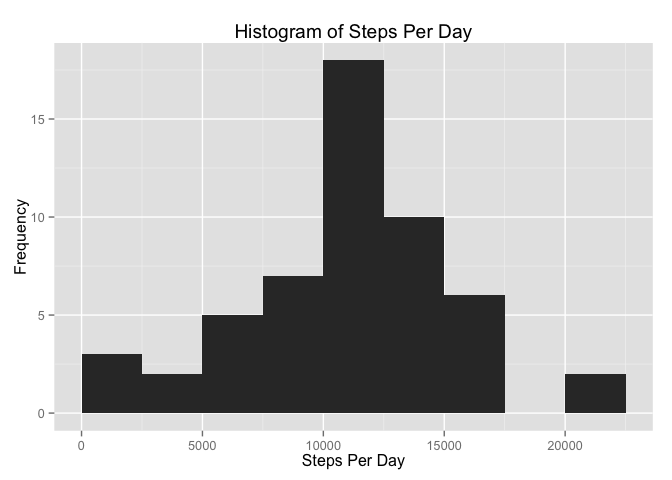
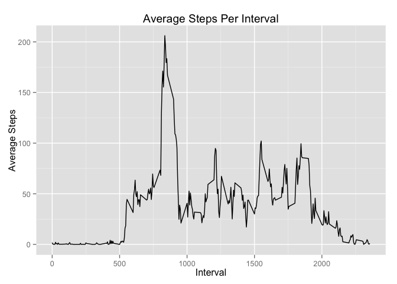
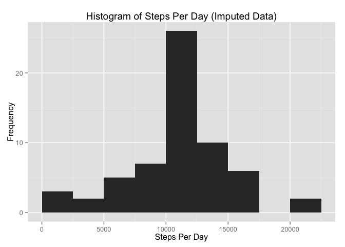
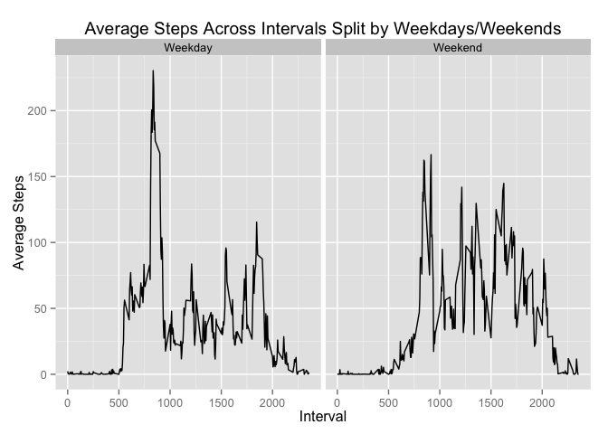

# Reproducible Research: Peer Assessment 1
###Reading in data

```r
url="https://d396qusza40orc.cloudfront.net/repdata%2Fdata%2Factivity.zip"
download.file(url,destfile="./monitordata.zip",method="curl")
unzip("monitordata.zip")
act=read.csv("activity.csv")
```

#Histogram of total steps per day

```r
stepsday=tapply(act$steps,act$date,sum)
library(ggplot2)
qplot(stepsday,binwidth=2500,xlim=c(0,22500),xlab="Steps Per Day",
ylab="Frequency",main="Histogram of Steps Per Day")
```

\

#Mean and median steps per day

```r
#Mean
mean(stepsday,na.rm=TRUE)
```

```
## [1] 10766.19
```

```r
#Median
median(stepsday,na.rm=TRUE)
```

```
## [1] 10765
```

#Average daily activity pattern
Remove NA values and load dplyr package

```r
library(dplyr)
```

```
## 
## Attaching package: 'dplyr'
```

```
## The following objects are masked from 'package:stats':
## 
##     filter, lag
```

```
## The following objects are masked from 'package:base':
## 
##     intersect, setdiff, setequal, union
```

```r
act2=na.omit(act)
```

Group data by interval, find the mean at each interval, and plot the time series

```r
stepsinterval=summarize(group_by(act2,interval),mean=mean(steps))
qplot(stepsinterval$interval,stepsinterval$mean,geom="line",xlab="Interval",ylab="Average Steps",main = "Average Steps Per Interval")
```

\

Find the 5 minute interval on average that contains the maxium number of steps

```r
stepsinterval[stepsinterval$mean==max(stepsinterval$mean),1]
```

```
## Source: local data frame [1 x 1]
## 
##   interval
##      (int)
## 1      835
```

#Imputing missing values
Calculate the number of missing values

```r
sum(is.na(act$steps))
```

```
## [1] 2304
```

Use the mean of an interval across all days to impute missing data in a given interval

```r
act3=merge(act,stepsinterval,by.x="interval",by.y="interval")
act4=mutate(act3,impsteps=ifelse(is.na(steps),mean,steps))
act5=arrange(act4,date,interval)
```

Histogram of total steps per day with imputed data

```r
act6=summarize(group_by(act5,date),totalsteps=sum(impsteps))
qplot(act6$totalsteps,binwidth=2500,xlim=c(0,22500),xlab="Steps Per Day",ylab="Frequency",main="Histogram of Steps Per Day (Imputed Data)")
```

\

Mean and median steps per day with imputed data

```r
#Mean
mean = round(mean(act6$totalsteps),digits=2)
#Median
median = round(median(act6$totalsteps),digits=2)
```
The mean does not change with or without imputed data and is 1.076619\times 10^{4}.  It turns out that when there is missing data for a given interval and day in this data set, data is missing for that entire day. Thus as we impute the missing values, we are ultimately imputing the entire day with the mean steps per day. Adding observations to a distribution that are equal to the mean of the distribution do not change the distribution.

The median does change with imputed data and is 1.076619\times 10^{4}.  Below is the reason why. As stated above we added many more observations to the distribution that are exactly equal to the mean, so the distribution at the mean has a much higher frequency.  The increaes in frequency was enough to shift the median to the mean.

#Differentiate activity patterns between weekdays and weekends
Add weekday/weekend indicator and format data

```r
act5$date=strptime(as.character(act5$date),"%Y-%m-%d")
act5=mutate(act5,day=ifelse(weekdays(date)=="Saturday"|weekdays(date)=="Sunday","Weekend","Weekday"))
act5$day=as.factor(act5$day)
act5=act5[,c(1,2,4:6)]
act6=mutate(summarize(group_by(filter(act5,day=="Weekday"),interval),meansteps=mean(impsteps)),set="Weekday")
act7=mutate(summarize(group_by(filter(act5,day=="Weekend"),interval),meansteps=mean(impsteps)),set="Weekend")
act8=rbind(act6,act7)
```

Plot average steps across intervals

```r
qplot(data=act8,x=interval,y=meansteps,facets=~set,geom="line",xlab="Interval",ylab="Average Steps",
main="Average Steps Across Intervals Split by Weekdays/Weekends")
```

\

